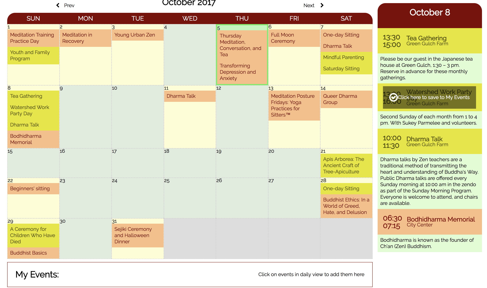

# San Francisco Zen Center Calendar
> A calendar to display events in monthly and daily views

This calendar app is a response to a very unfriendly user experience of trying to find out about meditating activities at San Francisco Zen Center. Users can:

* view monthly activities at a glance
* view daily activities in a larger detail view
* save and remove events they want to remember
* navigate to next and previous month
* see the current date

The two location of Zen Center are easy to tell apart because of their distinct color-codes.

> [Demo here](http://venablena-calendar.surge.sh)

## Installation

Clone this repository to your local computer and open 'index.html'

## Next Steps 

* Connect the calendar view to the event interface and database to complete the admin experience
* Automatically populate recurring events
* Grey out past dates
